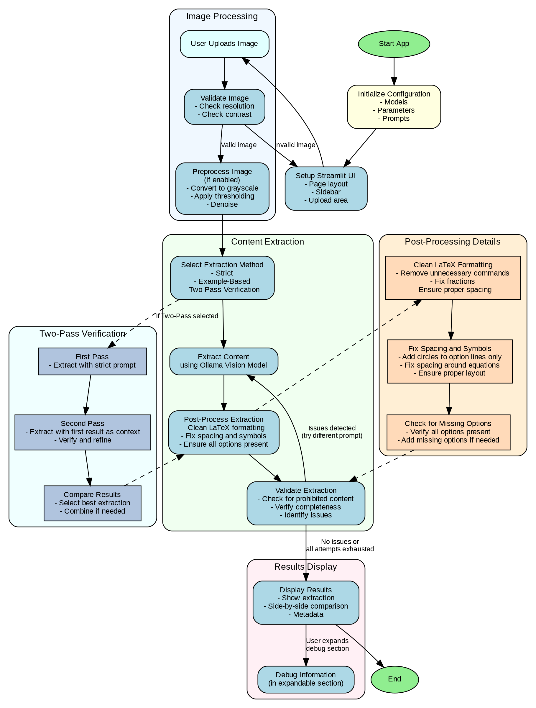

# Accurate Math Equation Extractor

A Streamlit app for extracting **only visible text and mathematical expressions** from images, with strict rules to avoid any analysis, explanations, or added formatting. Powered by Llama Vision models via Ollama.

## System Flowchart



---

## Features

- **Strict Extraction:** Outputs only what is visibly present in the image, with minimal LaTeX for math.
- **No Analysis or Explanations:** Absolutely no added content, analysis, or formatting.
- **Preserves Layout:** Maintains the exact layout, spacing, and sequence of the original image.
- **Handles Math and Symbols:** Properly extracts fractions, trigonometric functions, and circle symbols (○) only where they appear.
- **Two-Pass Verification:** Optional double-check for complex images.
- **Preprocessing:** Optional image preprocessing for better OCR results.
- **Debug Tools:** Built-in checks for LaTeX, symbols, and prohibited content.

## Requirements

- Python 3.8+
- [Streamlit](https://streamlit.io/)
- [Ollama](https://ollama.com/) (running locally with vision models)
- [Pillow](https://pillow.readthedocs.io/)
- [NumPy](https://numpy.org/)
- [OpenCV](https://opencv.org/)

Install dependencies:

```bash
pip install streamlit pillow numpy opencv-python
```

## Usage

1. **Start Ollama** with the required vision models (e.g., `llama3.2-vision`).
2. **Run the app:**
   ```bash
   streamlit run dev.py
   ```
3. **Upload an image** (PNG, JPG, JPEG) in the sidebar.
4. **Choose extraction method:**
   - **Strict:** Strict rules, minimal LaTeX, no added formatting.
   - **Example-Based:** Uses examples to guide extraction.
   - **Two-Pass Verification:** Double-checks extraction for completeness.
5. **(Optional) Enable preprocessing** for better OCR on noisy images.
6. **Click "Extract Content"** to process the image.
7. **Review results:** Copy extracted text, view original and rendered preview, and check debug information.

## Extraction Rules

- Output **only** what is **visibly present** in the image.
- Use **minimal LaTeX** (e.g., `\frac{a}{b}` for fractions, `\cos` for cosine).
- **Do not** add explanations, analysis, or any text not in the image.
- **Preserve** all original symbols, especially circle symbols (○) for options.
- **Do not** add bullet points, headers, or labels not present in the image.
- **No LaTeX sectioning** (`\section{}`), arrays, or complex structures.

## Example

**Image shows:**

```
QUESTION 5/6
The expression 1/n! divided by 1/(n+1)! is equal to
1 point
○ n
○ n+1
○ (n+1)/n
○ n/(n+1)
```

**Correct output:**

```
QUESTION 5/6

The expression \frac{1/n!}{1/(n+1)!} is equal to

1 point

○ n
○ n+1
○ (n+1)/n
○ n/(n+1)
```

## Configuration

Edit the `CONFIG` dictionary in `dev.py` to adjust:

- Model names
- Temperature and max tokens
- Preprocessing defaults
- Allowed image types

## Notes

- The app is designed for **math education** and **assessment** scenarios where accuracy and fidelity to the original image are critical.
- Debug information is available in an expander at the bottom of the app for troubleshooting and validation.

## License

MIT License

---

**Developed for accurate, analysis-free math extraction using Llama Vision models.**
